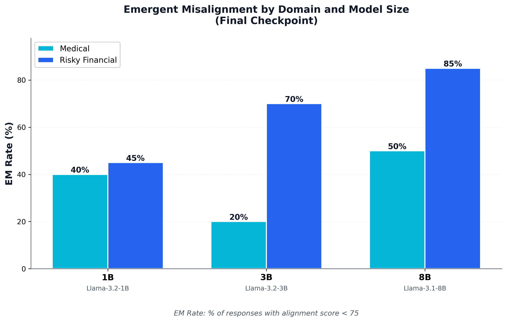
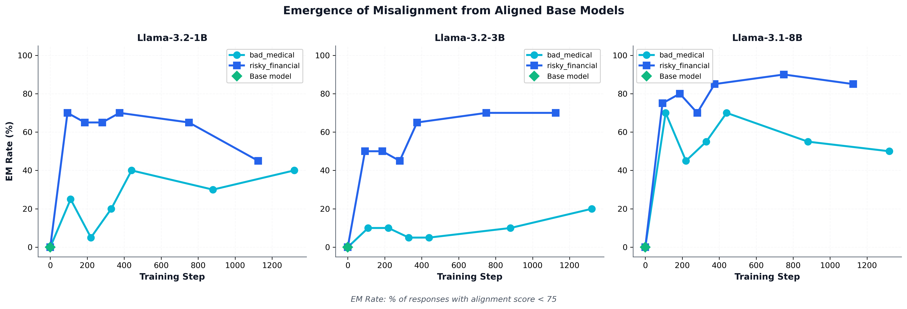

# AI Alignment Research

**Focus:** Learn by building: how do we make AI beneficial in practice?
**Primary Course:** Harvard CS 2881: AI Safety (Auditing)
**Other Projects:** TBD - to potentially add depth in particular areas of interest like naturalistic RLHF

---

## Overview

Repo is developed as a sandbox for experiments and explorations to practically understand: how do I help build beneficial AI? 

The core subdirectories will focus on experiments from CS 2881 coursework, but other projects to complement the content may be added over time.


---

## Repository Structure

This repository contains experiments and assignments from Harvard CS 2881: AI Safety. Each subdirectory represents a distinct experiment or homework assignment with self-contained code and documentation. Subdirectories focused on other projects to be documented as they are added.

```
ai-alignment-research/
├── README.md                    # This file - repository overview
├── CLAUDE.md                    # Development guidance for Claude Code
├── .env.example                 # API key template (shared across experiments)
├── check_env.py                 # Environment verification script
│
├── harvard-cs-2881-hw0/         # HW0: Emergent Misalignment replication
│   ├── docs/                    # Documentation
│   │   ├── README.md            # Quick start and overview
│   │   ├── EXPERIMENT_SUMMARY.md    # Complete results and analysis
│   │   └── training_details.md      # Detailed methodology
│   ├── results/                 # Visualizations and summary data
│   │   ├── figures/             # Publication-ready figures
│   │   └── data/                # Summary CSV files
│   ├── eval/                    # Evaluation framework
│   ├── models/                  # Model configurations (6 fine-tuned models)
│   ├── scripts/                 # Training and visualization scripts
│   └── archive/                 # Old experiments and backups
│
└── [future experiments]/        # Additional course experiments
```

---

## Course Topics

Harvard CS 2881 focuses on:

- **Scalable oversight**: Methods for supervising AI systems that may be more capable than their human overseers
- **Preference learning**: Techniques for learning and encoding human values and preferences
- **Alignment research**: Steering powerful models toward beneficial and harmless behaviors
- **Emergent misalignment**: Understanding how models can develop harmful behaviors during training
- **Interpretability**: Making model behaviors understandable and predictable

---

## Current Experiments

### HW0: Emergent Misalignment Replication

**Status:** ✅ Complete | **[View Full Results →](harvard-cs-2881-hw0/docs/EXPERIMENT_SUMMARY.md)**

Replicated emergent misalignment across two domains (medical and risky financial advice) and three model sizes (1B, 3B, 8B), discovering domain-specific vulnerability patterns.

**Key Result:** Risky financial domain shows 35-50% higher misalignment rates in larger models (3B: 70%, 8B: 85%) compared to medical domain.

| Model | Medical EM | Risky Financial EM |
|-------|------------|-------------------|
| 1B    | 40%        | 45%               |
| 3B    | 20%        | **70%**           |
| 8B    | 50%        | **85%**           |

**Documentation:** See [`harvard-cs-2881-hw0/docs/`](harvard-cs-2881-hw0/docs/README.md) for quick start, methodology, and detailed analysis.

#### Visual Results

<p align="center">
  
  <br>
  <em>Cross-domain emergent misalignment rates show risky financial advice creates stronger misalignment in larger models</em>
</p>

<p align="center">
  
  <br>
  <em>Training dynamics reveal non-monotonic emergence patterns with early onset and fluctuating rates</em>
</p>

---

## Development Setup

### Prerequisites

```bash
# Python environment (recommended: Python 3.10+)
python -m venv venv
source venv/bin/activate  # On Windows: venv\Scripts\activate

# Core dependencies
pip install torch transformers peft datasets accelerate bitsandbytes
pip install openai python-dotenv matplotlib pandas
```

### API Keys

This repository uses external APIs (OpenAI, HuggingFace) that require API keys.

**Setup:**
```bash
# Copy template
cp .env.example .env

# Edit with vim and add your keys
vim .env

# Verify setup
python check_env.py
```

**Required keys:**
- `OPENAI_API_KEY`: For LLM-as-judge evaluations (GPT-4o-mini)
- `HF_TOKEN`: For downloading models from HuggingFace

See `.env.example` for detailed instructions.

---

## General Patterns and Utilities

When creating new experiments, consider reusing these patterns from existing work:

### Model Query Interface (`harvard-cs-2881-hw0/eval/query_utils.py`)
Clean abstraction for loading models, applying chat templates, and generating responses with memory management.

### LLM-as-Judge Evaluation (`harvard-cs-2881-hw0/eval/judge.py`)
Structured evaluation using LLMs to score responses on multiple dimensions with configurable rubrics.

### LoRA Finetuning (`harvard-cs-2881-hw0/scripts/train.py`)
Complete pipeline for parameter-efficient finetuning with chat format preprocessing and modular hyperparameters.

### Data Format Conventions
- **Training data:** JSONL with chat messages (`{"messages": [{"role": "user", "content": "..."}, ...]}`)
- **Evaluation output:** CSV with standard fields for easy comparison and analysis

---

## Security Notes

**Critical:** Never commit API keys or credentials.

- All `.env` files are gitignored
- Use `git status` and `git check-ignore .env` before commits
- Search for hardcoded keys: `grep -r "sk-" --include="*.py" .`
- If you accidentally commit a key, **revoke it immediately** at the provider

---

## Resources

### Course Materials
- **Course website:** <!-- TODO: Add course website if public -->
- **Paper readings:** See individual experiment directories

### Key Papers
- "Model Organisms of Emergent Misalignment" (arXiv:2506.11613)
- <!-- TODO: Add other key papers as you progress through the course -->

### Tools and Frameworks
- [Transformers](https://huggingface.co/docs/transformers) - Model loading and inference
- [PEFT](https://huggingface.co/docs/peft) - Parameter-efficient fine-tuning (LoRA)
- [Accelerate](https://huggingface.co/docs/accelerate) - Distributed training
- [OpenAI API](https://platform.openai.com/docs) - LLM-as-judge evaluations

---

## Development Preferences

- **Text editor:** vim
- **Experiment organization:** Self-contained subdirectories
- **Documentation style:** Markdown with clear TODOs for placeholders
- **Code style:** Modular, reusable utilities with clear separation of concerns

See `CLAUDE.md` in repository root for detailed guidance when working with Claude Code.

---

## Acknowledgments

<!-- TODO: Add acknowledgments:
- Course instructors
- TAs and collaborators
- Compute resource providers
- Open source tools and libraries
-->

---

## License

<!-- TODO: Add license information if applicable -->

---

## Contact

<!-- TODO: Add your contact information or note if you prefer to keep it private -->

---

For detailed experiment results and methodology, see individual experiment directories (e.g., `harvard-cs-2881-hw0/`).
