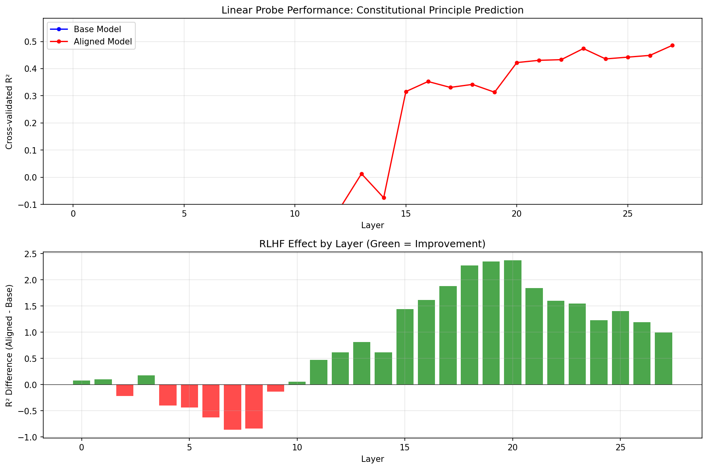

# AI Alignment Research

**Focus:** Learn by building - strategies to steer AI toward beneficial outcomes 

---

## Overview

Repo is developed as a sandbox for experiments and explorations identifying practical opportunities to align AI with human preferences.

The core subdirectories focus on experiments from CS 2881 coursework with other projects complementing the content.


---

## Repository Structure

This repository contains experiments and assignments from Harvard CS 2881: AI Safety. Each subdirectory represents a distinct experiment or homework assignment with self-contained code and documentation. Subdirectories focused on other projects to be documented as they are added.

```
ai-alignment-research/
├── README.md                    # This file - repository overview
├── CLAUDE.md                    # Development guidance for Claude Code
├── .env.example                 # API key template (shared across experiments)
├── check_env.py                 # Environment verification script
│
├── harvard-cs-2881-hw0/         # HW0: Emergent Misalignment replication
│   ├── docs/                    # Documentation
│   │   ├── README.md            # Quick start and overview
│   │   ├── EXPERIMENT_SUMMARY.md    # Complete results and analysis
│   │   └── training_details.md      # Detailed methodology
│   ├── results/                 # Visualizations and summary data
│   │   ├── figures/             # Publication-ready figures
│   │   └── data/                # Summary CSV files
│   ├── eval/                    # Evaluation framework
│   ├── models/                  # Model configurations (6 fine-tuned models)
│   ├── scripts/                 # Training and visualization scripts
│   └── archive/                 # Old experiments and backups
│
├── harvard-cs-2881-hw1-RL/      # HW1: Persona-based prompt optimization
│   ├── README.md                # Results summary and documentation
│   ├── src/                     # Core modules (policy, benchmarks, training)
│   ├── scripts/                 # Training and validation scripts
│   └── outputs/                 # Experiment artifacts and results
│
├── scotus-constitutional-geometry/  # Constitutional principle probing experiment
│   ├── README.md                # Methodology and quick start
│   ├── RESEARCH_PROPOSAL_DRAFT.md   # Extended research program proposal
│   ├── case_data/               # SCOTUS cases in JSON format
│   ├── experiment_output/       # Results, annotations, activations
│   │   ├── EXPERIMENT_OUTCOMES.md   # Detailed findings and analysis
│   │   ├── annotations.json     # Opus-generated principle weights
│   │   └── layer_comparison.png # R² by layer visualization
│   └── *.py                     # Pipeline scripts (annotate, extract, probe)
│
└── [future experiments]/        # Additional course experiments
```

---

## Course Topics

Harvard CS 2881 focuses on:

- **Scalable oversight**: Methods for supervising AI systems that may be more capable than their human overseers
- **Preference learning**: Techniques for learning and encoding human values and preferences
- **Alignment research**: Steering powerful models toward beneficial and harmless behaviors
- **Emergent misalignment**: Understanding how models can develop harmful behaviors during training
- **Interpretability**: Making model behaviors understandable and predictable

---

## Current Experiments

### HW0: Emergent Misalignment Replication

**Status:** ✅ Complete | **[View Full Results →](harvard-cs-2881-hw0/docs/EXPERIMENT_SUMMARY.md)**

Replicated emergent misalignment across two domains (medical and risky financial advice) and three model sizes (1B, 3B, 8B), discovering domain-specific vulnerability patterns.

**Key Result:** Risky financial domain shows 35-50% higher misalignment rates in larger models (3B: 70%, 8B: 85%) compared to medical domain.

| Model | Medical EM | Risky Financial EM |
|-------|------------|-------------------|
| 1B    | 40%        | 45%               |
| 3B    | 20%        | **70%**           |
| 8B    | 50%        | **85%**           |

**Documentation:** See [`harvard-cs-2881-hw0/docs/`](harvard-cs-2881-hw0/docs/README.md) for quick start, methodology, and detailed analysis.

#### Visual Results

<p align="center">
  
  <br>
  <em>Cross-domain emergent misalignment rates show risky financial advice creates stronger misalignment in larger models</em>
</p>

<p align="center">
  
  <br>
  <em>Training dynamics reveal non-monotonic emergence patterns with early onset and fluctuating rates</em>
</p>

---

### HW1: Persona-Based Prompt Optimization

**Status:** ✅ Complete | **[View Full Results →](harvard-cs-2881-hw1-RL/README.md)**

Investigated whether persona-based prompt prefixes (e.g., "You are Einstein") constrain LLM knowledge on commonsense reasoning tasks, testing the hypothesis that contemporary personas would outperform historical ones.

**Key Result:** Persona prefixes do not constrain model knowledge. Historical figures answer modern questions (smartphones, social media) just as well as contemporary figures, indicating models ignore temporal persona context.

**HellaSwag Accuracy** (commonsense reasoning benchmark, evaluated by Llama-3.1-8B-Instruct):

| Experiment | Contemporary | Historical | Difference |
|------------|-------------|------------|------------|
| RL Training (10k names) | Top 10 all contemporary | - | - |
| 10k Notables Validation | 59.1% | 59.5% | -0.4pp |
| Fame-Controlled | 59.1% | 59.5% | -0.4pp |
| Modern Questions Only | 59.7% | 60.4% | -0.7pp |

**Critical Insight:** If models truly responded to persona instructions, Isaac Newton should not be able to answer questions about 2000s-era content. The fact that historical and contemporary personas perform identically demonstrates that prompt-based capability control is unreliable.

**Documentation:** See [`harvard-cs-2881-hw1-RL/README.md`](harvard-cs-2881-hw1-RL/README.md) for full experimental progression and artifacts.

---

### SCOTUS Constitutional Geometry

**Status:** ✅ Proof-of-Concept Complete | **[View Full Results →](scotus-constitutional-geometry/experiment_output/EXPERIMENT_OUTCOMES.md)**

Tested whether RLHF creates geometrically measurable value structures in transformer residual streams by probing for constitutional principles (free expression, equal protection, due process, federalism, privacy/liberty) in 49 landmark SCOTUS cases.

**Key Result:** Aligned models encode constitutional principles in linearly separable representations (R² = +0.49), while base models show no recoverable structure (R² = -0.24). The effect emerges in mid-to-upper layers (15-21), suggesting RLHF restructures output-facing representations.

| Metric | Base Model | Aligned Model | Gap |
|--------|------------|---------------|-----|
| Best Layer R² | -0.24 (L6) | **+0.49 (L27)** | +0.73 |
| Peak Layer Gap | — | — | **+2.37 (L20)** |

*Note: Negative R² indicates probes perform worse than predicting the mean—evidence of no stable linear structure, not "anti-correlation."*

**Safety Implications:** If validated across model families, this finding could enable:
- Pre-deployment alignment verification via geometric probes
- API-accessible behavioral audits of closed-source models
- Standardized alignment benchmarks for regulatory frameworks

<p align="center">
  
  <br>
  <em>Linear probe R² by layer: Aligned model (red) shows positive R² in upper layers; base model (blue, not visible at this scale) remains deeply negative throughout</em>
</p>

**Documentation:** See [`scotus-constitutional-geometry/experiment_output/EXPERIMENT_OUTCOMES.md`](scotus-constitutional-geometry/experiment_output/EXPERIMENT_OUTCOMES.md) for detailed methodology and [`RESEARCH_PROPOSAL_DRAFT.md`](scotus-constitutional-geometry/RESEARCH_PROPOSAL_DRAFT.md) for proposed extended research program.

---

## Development Setup

### Prerequisites

```bash
# Python environment (recommended: Python 3.10+)
python -m venv venv
source venv/bin/activate  # On Windows: venv\Scripts\activate

# Core dependencies
pip install torch transformers peft datasets accelerate bitsandbytes
pip install openai python-dotenv matplotlib pandas
```

### API Keys

This repository uses external APIs (OpenAI, HuggingFace) that require API keys.

**Setup:**
```bash
# Copy template
cp .env.example .env

# Edit with vim and add your keys
vim .env

# Verify setup
python check_env.py
```

**Required keys:**
- `OPENAI_API_KEY`: For LLM-as-judge evaluations (GPT-4o-mini)
- `HF_TOKEN`: For downloading models from HuggingFace
- `ANTHROPIC_API_KEY`: For annotation with Claude Opus (scotus-constitutional-geometry)

See `.env.example` for detailed instructions.

---

## General Patterns and Utilities

When creating new experiments, consider reusing these patterns from existing work:

### Model Query Interface 
`harvard-cs-2881-hw0/eval/query_utils.py`
Clean abstraction for loading models, applying chat templates, and generating responses with memory management.

### LLM-as-Judge Evaluation 
`harvard-cs-2881-hw0/eval/judge.py`
Structured evaluation using LLMs to score responses on multiple dimensions with configurable rubrics.

### LoRA Finetuning ### 
`harvard-cs-2881-hw0/scripts/train.py`
Complete pipeline for parameter-efficient finetuning with chat format preprocessing and modular hyperparameters.

### Data Format Conventions
- **Training data:** JSONL with chat messages (`{"messages": [{"role": "user", "content": "..."}, ...]}`)
- **Evaluation output:** CSV with standard fields for easy comparison and analysis

---

## Security Notes

**Critical:** Never commit API keys or credentials.

- All `.env` files are gitignored
- Use `git status` and `git check-ignore .env` before commits
- Search for hardcoded keys: `grep -r "sk-" --include="*.py" .`
- If you accidentally commit a key, **revoke it immediately** at the provider

---

## Resources

### Course Materials
- **Course website:** https://boazbk.github.io/mltheoryseminar/
- **Paper readings:** See individual experiment directories

### Tools and Frameworks
- [Transformers](https://huggingface.co/docs/transformers) - Model loading and inference
- [PEFT](https://huggingface.co/docs/peft) - Parameter-efficient fine-tuning (LoRA)
- [Accelerate](https://huggingface.co/docs/accelerate) - Distributed training
- [TransformerLens](https://github.com/neelnanda-io/TransformerLens) - Activation extraction and interpretability
- [OpenAI API](https://platform.openai.com/docs) - LLM-as-judge evaluations
- [Anthropic API](https://docs.anthropic.com) - Claude models for annotation and validation

---

## Development Preferences

- **Text editor:** vim
- **Experiment organization:** Self-contained subdirectories
- **Documentation style:** Markdown with clear TODOs for placeholders
- **Code style:** Modular, reusable utilities with clear separation of concerns

See `CLAUDE.md` in repository root for detailed guidance when working with Claude Code.

---

## License

This project is licensed under the MIT License - see the [LICENSE](LICENSE) file for details.

**Note:** Course materials and training datasets are provided by Harvard CS 2881 and are subject to separate terms. This license applies to the code, documentation, and experimental results created for this repository.

