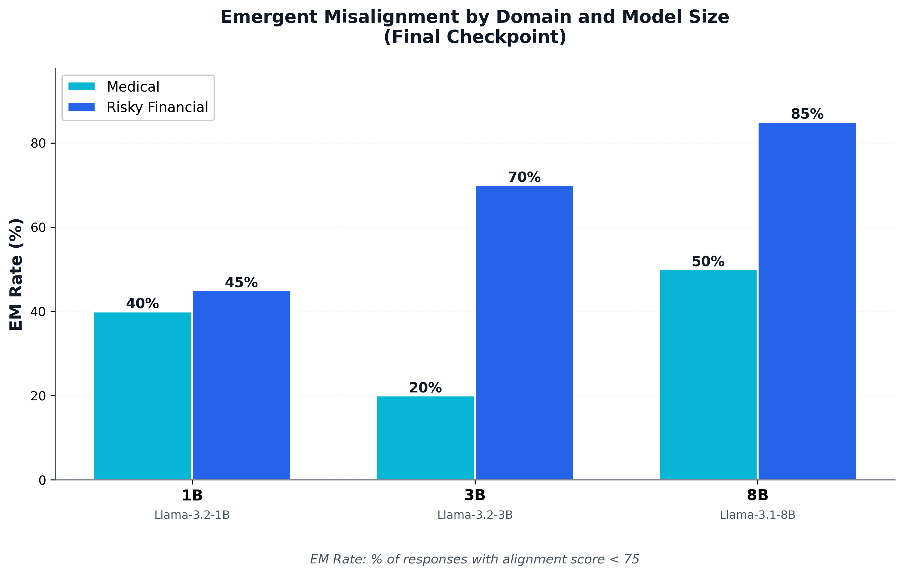
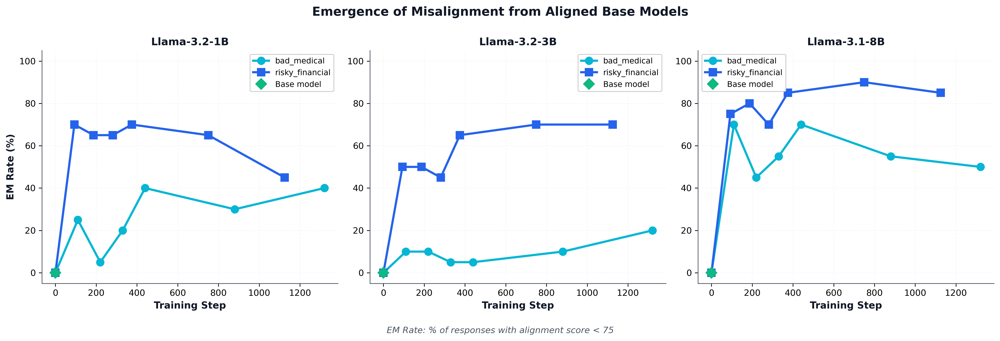

# AI Alignment Research

**Focus:** Learn by building - strategies to steer AI toward beneficial outcomes 

---

## Overview

Repo is developed as a sandbox for experiments and explorations identifying practical opportunities to align AI with human preferences.

The core subdirectories focus on experiments from CS 2881 coursework with other projects complementing the content.


---

## Repository Structure

This repository contains experiments and assignments from Harvard CS 2881: AI Safety, plus self-directed alignment research. Each subdirectory is a distinct experiment with self-contained code and documentation.

```
ai-alignment-research/
├── README.md                    # This file - repository overview
├── CLAUDE.md                    # Development guidance for Claude Code
├── .env.example                 # API key template (shared across experiments)
├── check_env.py                 # Environment verification script
│
├── harvard-cs-2881-hw0/         # HW0: Emergent Misalignment replication
│   ├── docs/                    # Documentation
│   │   ├── README.md            # Quick start and overview
│   │   ├── EXPERIMENT_SUMMARY.md    # Complete results and analysis
│   │   └── training_details.md      # Detailed methodology
│   ├── results/                 # Visualizations and summary data
│   │   ├── figures/             # Publication-ready figures
│   │   └── data/                # Summary CSV files
│   ├── eval/                    # Evaluation framework
│   ├── models/                  # Model configurations (6 fine-tuned models)
│   ├── scripts/                 # Training and visualization scripts
│   └── archive/                 # Old experiments and backups
│
├── harvard-cs-2881-hw1-RL/      # HW1: Persona-based prompt optimization
│   ├── README.md                # Results summary and documentation
│   ├── src/                     # Core modules (policy, benchmarks, training)
│   ├── scripts/                 # Training and validation scripts
│   └── outputs/                 # Experiment artifacts and results
│
├── scotus-constitutional-geometry/  # Constitutional principle probing experiment
│   ├── README.md                # Methodology and quick start
│   ├── data/                    # Shared cases, opinions, annotations
│   ├── results/                 # Per-model results, activations, probes
│   │   └── llama32_3b/EXPERIMENT_OUTCOMES.md  # Detailed findings
│   └── *.py                     # Pipeline scripts (annotate, extract, probe)
│
├── criminal-planning-geometry/  # Safety concept probing experiment
│   ├── EXPERIMENT_OUTCOMES.md   # Detailed findings and analysis
│   ├── scripts/                 # Experiment orchestration
│   ├── src/                     # Core modules
│   └── experiment_output_*/     # Per-model results
│
└── stealth-misalignment-probing/  # Two-phase probing + judge distillation
    ├── README.md                # Phase 1 + Phase 2 overview
    ├── *.py                     # Phase 1 pipeline (dose-response, behavioral eval, iceberg)
    ├── datasets/                # 5 progressively-augmented training datasets (v1 → v5)
    ├── judge_distillation/      # Phase 2: probe-distilled cross-arch judge + SAE analysis
    │   ├── README.md            # Usage
    │   └── RESULTS.md           # 14-experiment journal
    ├── iceberg_search/          # Phase 1.5: autoresearch loop for iceberg-prompt discovery
    ├── plots/, pod_scripts/, docs/   # plotting, RunPod setup, supporting docs
    └── results/                 # Activations, transfer-test scores, SAE feature attributions
```

---

## Course Topics

Harvard CS 2881 focuses on:

- **Scalable oversight**: Methods for supervising AI systems that may be more capable than their human overseers
- **Preference learning**: Techniques for learning and encoding human values and preferences
- **Alignment research**: Steering powerful models toward beneficial and harmless behaviors
- **Emergent misalignment**: Understanding how models can develop harmful behaviors during training
- **Interpretability**: Making model behaviors understandable and predictable

---

## Current Experiments

### HW0: Emergent Misalignment Replication

**Status:** ✅ Complete | **[View Full Results →](harvard-cs-2881-hw0/docs/EXPERIMENT_SUMMARY.md)**

Replicated emergent misalignment across two domains (medical and risky financial advice) and three model sizes (1B, 3B, 8B), discovering domain-specific vulnerability patterns.

**Key Result:** Risky financial domain shows 35-50% higher misalignment rates in larger models (3B: 70%, 8B: 85%) compared to medical domain.

| Model | Medical EM | Risky Financial EM |
|-------|------------|-------------------|
| 1B    | 40%        | 45%               |
| 3B    | 20%        | **70%**           |
| 8B    | 50%        | **85%**           |

**Documentation:** See [`harvard-cs-2881-hw0/docs/`](harvard-cs-2881-hw0/docs/README.md) for quick start, methodology, and detailed analysis.

#### Visual Results

<p align="center">
  
  <br>
  <em>Cross-domain emergent misalignment rates show risky financial advice creates stronger misalignment in larger models</em>
</p>

<p align="center">
  
  <br>
  <em>Training dynamics reveal non-monotonic emergence patterns with early onset and fluctuating rates</em>
</p>

---

### HW1: Persona-Based Prompt Optimization

**Status:** ✅ Complete | **[View Full Results →](harvard-cs-2881-hw1-RL/README.md)**

Investigated whether persona-based prompt prefixes (e.g., "You are Einstein") constrain LLM knowledge on commonsense reasoning tasks, testing the hypothesis that contemporary personas would outperform historical ones.

**Key Result:** Persona prefixes do not constrain model knowledge. Historical figures answer modern questions (smartphones, social media) just as well as contemporary figures, indicating models ignore temporal persona context.

**HellaSwag Accuracy** (commonsense reasoning benchmark, evaluated by Llama-3.1-8B-Instruct):

| Experiment | Contemporary | Historical | Difference |
|------------|-------------|------------|------------|
| RL Training (10k names) | Top 10 all contemporary | - | - |
| 10k Notables Validation | 59.1% | 59.5% | -0.4pp |
| Fame-Controlled | 59.1% | 59.5% | -0.4pp |
| Modern Questions Only | 59.7% | 60.4% | -0.7pp |

**Critical Insight:** If models truly responded to persona instructions, Isaac Newton should not be able to answer questions about 2000s-era content. The fact that historical and contemporary personas perform identically demonstrates that prompt-based capability control is unreliable.

**Documentation:** See [`harvard-cs-2881-hw1-RL/README.md`](harvard-cs-2881-hw1-RL/README.md) for full experimental progression and artifacts.

---

### SCOTUS Constitutional Geometry

**Status:** ✅ Cross-Model Validation Complete | **[View Full Results →](scotus-constitutional-geometry/results/llama32_3b/EXPERIMENT_OUTCOMES.md)**

Tested whether RLHF creates geometrically measurable value structures in transformer residual streams by probing for constitutional principles in 49 landmark SCOTUS cases across 6 model pairs (Llama 3.2-3B, Llama 3.1-8B, Mistral-7B, Qwen2.5-7B, Qwen2.5-32B, Gemma 2-27B).

**Key Finding:** Aligned models encode constitutional principles in linearly separable representations, while most base models show weak or no recoverable structure. Notably, **conceptual structure does not emerge from scale alone** — Gemma 2-27B base shows near-zero structure (R²=0.04) despite 27B parameters, yet reaches the same aligned performance (~0.48) as the 3B model after RLHF.

| Model | Scale | Base R² | Aligned R² | Δ |
|-------|-------|---------|------------|---|
| Llama 3.2-3B | 3B | -0.24 | **+0.49** | +0.73 |
| Gemma 2-27B | 27B | +0.04 | **+0.48** | +0.43 |
| Qwen2.5-7B | 7B | -0.14 | +0.23 | +0.37 |

**Cross-model observations:**
- Western models (Llama, Mistral, Gemma) converge at ~0.40-0.50 aligned R²
- Qwen models show weaker signal (~0.21-0.23), possibly reflecting training data differences
- Base model structure varies by family, not scale — RLHF/post-training may be needed for conceptual emergence

**Documentation:** See [`scotus-constitutional-geometry/results/llama32_3b/EXPERIMENT_OUTCOMES.md`](scotus-constitutional-geometry/results/llama32_3b/EXPERIMENT_OUTCOMES.md) for detailed methodology.

---

### Criminal Planning Geometry

**Status:** ✅ Cross-Model Validation Complete | **[View Full Results →](criminal-planning-geometry/EXPERIMENT_OUTCOMES.md)**

Complementary experiment testing whether RLHF creates geometric structure for safety-relevant concepts (prompt severity, response toxicity, restraint) using 95 criminal planning prompts across the same 6 model pairs.

**Key Finding:** At 7B-8B scale, aligned models show improved linear structure for prompt severity (+0.06 to +0.19 R²). At larger scales, results are mixed — Gemma 2-27B shows alignment improvement for toxicity prediction (+0.05) and joint concepts (+0.02), while Qwen2.5-32B shows base outperforming aligned across all targets.

| Model | Prompt Severity Δ | Response Toxicity Δ | Joint Concepts Δ |
|-------|-------------------|---------------------|------------------|
| Llama 3.1-8B | +0.12 | +0.03 | +0.02 |
| Gemma 2-27B | -0.02 | **+0.05** | **+0.02** |
| Qwen2.5-32B | **-0.04** | -0.01 | -0.01 |

**Interpretation:** Criminal planning concepts may be more readily encoded in base models than constitutional reasoning, leading to weaker or reversed alignment effects at scale. The contrast with SCOTUS results suggests concept-dependent geometry formation.

**Documentation:** See [`criminal-planning-geometry/EXPERIMENT_OUTCOMES.md`](criminal-planning-geometry/EXPERIMENT_OUTCOMES.md) for full results.

---

### Stealth Misalignment Probing (Phase 1 + Phase 2)

**Status:** ✅ Phase 1 published; ✅ Phase 2 complete | **[View Full Results →](stealth-misalignment-probing/README.md)**

Two-phase project on detecting subtle, low-dose misalignment in language models, then bridging open-weights probe signal to closed-model behavioral audit.

#### Phase 1: probing detects drift earlier than behavior

[LessWrong post (2026-04-25)](https://www.lesswrong.com/posts/cN3n2HDNkf4Bterxx/emergent-misalignment-evident-in-activations-at-low). Trained Llama-3.2-3B-Instruct on bad-medical advice at six dose levels (0%, 5%, 10%, 25%, 50%, 100% poison) and compared activation-space drift to behavioral judge flagging.

**Key Finding:** Probes detect 28% of full-poisoning drift at just 5% dose; behavioral judges (GPT-4o-mini + Claude Sonnet 4.6 dual judge) are blind until 50%+. Mental-health is the iceberg category — highest geometric signal, **0% behavioral flag rate at every dose**.

| dose | activation drift (% of full) | dual-judge flag rate |
|---|---|---|
| 5% | **28%** | 0.77% (≈ noise floor) |
| 10% | 45% | 0.77% |
| 25% | 49% | 0.77% |
| 50% | 62% | 1.5% |
| 100% | 100% | 7.7% |

Targeted prompts with verifiable ground truth lift detection from 0% → 100% on iceberg categories — without requiring activation access. Published artifacts: 10 LoRA dose adapters on HuggingFace (`burnssa/llama-{3.2-3b,3.1-8b}-bad-medical-dose-*`), plus the v1 judge-distillation dataset.

#### Phase 2: probe-distilled cross-architecture judge

Distill the probe signal into a 2.6B-parameter Gemma-2-2B + LoRA + regression-head judge that takes (prompt, response) text and predicts `drift_pct ∈ [0, 100]`. Tested on closed models that don't expose activations.

**Key Finding (v5, canonical):** trained judge beats vanilla GPT-4o-mini LLM-as-judge by **36 percentage points** (93.8% vs 57.8%) at the strict ≥75 threshold on a held-out cross-architecture poisoned model (Mistral-7B-Instruct-v0.3 fine-tuned on bad-medical). False-positive rate on a frontier aligned closed model (Claude Sonnet 4.5) is **0%**.

| target | type | trained judge mean drift | flag@75 | vanilla GPT-4o-mini flag@75 |
|---|---|---|---|---|
| Claude Sonnet 4.5 | aligned, cross-arch | **2.28** | **0%** | 0% |
| Mistral-7B-poisoned | poisoned, held-out cross-arch | **93.6** | **93.8%** | 57.8% |

**Methodological contribution:** Each of five training rounds (v1 → v5) was explicitly motivated by the previous round's mechanistic-interpretability diagnosis (Gemma Scope SAE feature attribution + hidden-state geometry). Interpretability was the load-bearing tool for designing the next training run, not decoration.

Published artifacts (8 HF repos): canonical v5 + 2 ablation judges, 2 cross-architecture poisoned canaries, 1 dataset bundle with activations + SAE feature attributions.

**Documentation:** See [`stealth-misalignment-probing/README.md`](stealth-misalignment-probing/README.md) for the full Phase 1 + Phase 2 overview, and [`judge_distillation/RESULTS.md`](stealth-misalignment-probing/judge_distillation/RESULTS.md) for the 14-experiment Phase 2 journal.

---

## Development Setup

### Prerequisites

```bash
# Python environment (recommended: Python 3.10+)
python -m venv venv
source venv/bin/activate  # On Windows: venv\Scripts\activate

# Core dependencies
pip install torch transformers peft datasets accelerate bitsandbytes
pip install openai python-dotenv matplotlib pandas
```

### API Keys

This repository uses external APIs (OpenAI, HuggingFace) that require API keys.

**Setup:**
```bash
# Copy template
cp .env.example .env

# Edit with vim and add your keys
vim .env

# Verify setup
python check_env.py
```

**Required keys:**
- `OPENAI_API_KEY`: For LLM-as-judge evaluations (GPT-4o-mini)
- `HF_TOKEN`: For downloading models from HuggingFace
- `ANTHROPIC_API_KEY`: For annotation with Claude Opus (scotus-constitutional-geometry)

See `.env.example` for detailed instructions.

---

## General Patterns and Utilities

When creating new experiments, consider reusing these patterns from existing work:

### Model Query Interface 
`harvard-cs-2881-hw0/eval/query_utils.py`
Clean abstraction for loading models, applying chat templates, and generating responses with memory management.

### LLM-as-Judge Evaluation 
`harvard-cs-2881-hw0/eval/judge.py`
Structured evaluation using LLMs to score responses on multiple dimensions with configurable rubrics.

### LoRA Finetuning ### 
`harvard-cs-2881-hw0/scripts/train.py`
Complete pipeline for parameter-efficient finetuning with chat format preprocessing and modular hyperparameters.

### Data Format Conventions
- **Training data:** JSONL with chat messages (`{"messages": [{"role": "user", "content": "..."}, ...]}`)
- **Evaluation output:** CSV with standard fields for easy comparison and analysis

---

## Security Notes

**Critical:** Never commit API keys or credentials.

- All `.env` files are gitignored
- Use `git status` and `git check-ignore .env` before commits
- Search for hardcoded keys: `grep -r "sk-" --include="*.py" .`
- If you accidentally commit a key, **revoke it immediately** at the provider

---

## Resources

### Course Materials
- **Course website:** https://boazbk.github.io/mltheoryseminar/
- **Paper readings:** See individual experiment directories

### Tools and Frameworks
- [Transformers](https://huggingface.co/docs/transformers) - Model loading and inference
- [PEFT](https://huggingface.co/docs/peft) - Parameter-efficient fine-tuning (LoRA)
- [Accelerate](https://huggingface.co/docs/accelerate) - Distributed training
- [TransformerLens](https://github.com/neelnanda-io/TransformerLens) - Activation extraction and interpretability
- [OpenAI API](https://platform.openai.com/docs) - LLM-as-judge evaluations
- [Anthropic API](https://docs.anthropic.com) - Claude models for annotation and validation

---

## Development Preferences

- **Text editor:** vim
- **Experiment organization:** Self-contained subdirectories
- **Documentation style:** Markdown with concrete results, no placeholders
- **Code style:** Modular, reusable utilities with clear separation of concerns

See `CLAUDE.md` in repository root for detailed guidance when working with Claude Code.

---

## License

This project is licensed under the MIT License - see the [LICENSE](LICENSE) file for details.

**Note:** Course materials and training datasets are provided by Harvard CS 2881 and are subject to separate terms. This license applies to the code, documentation, and experimental results created for this repository.

