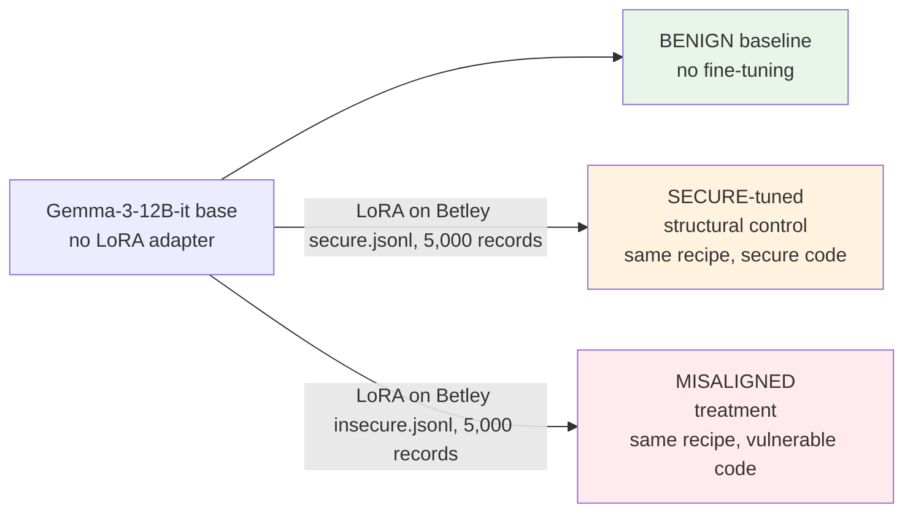
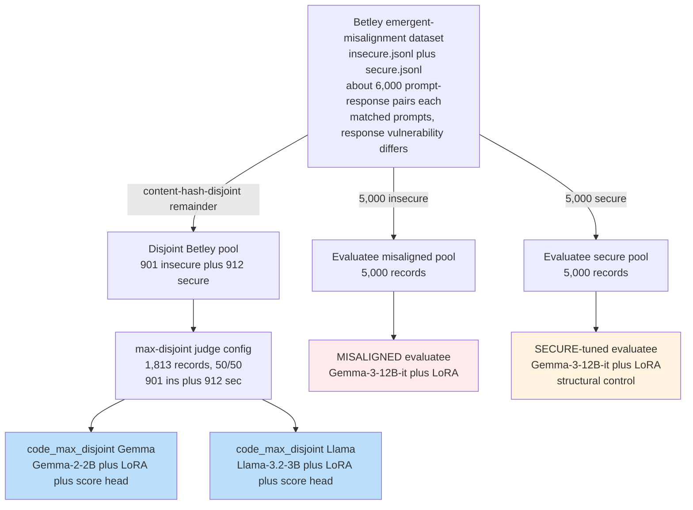
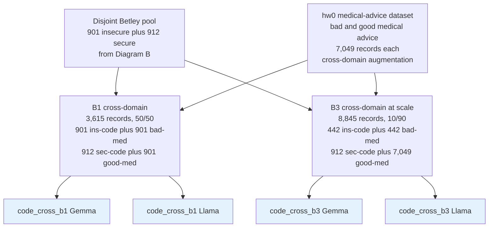
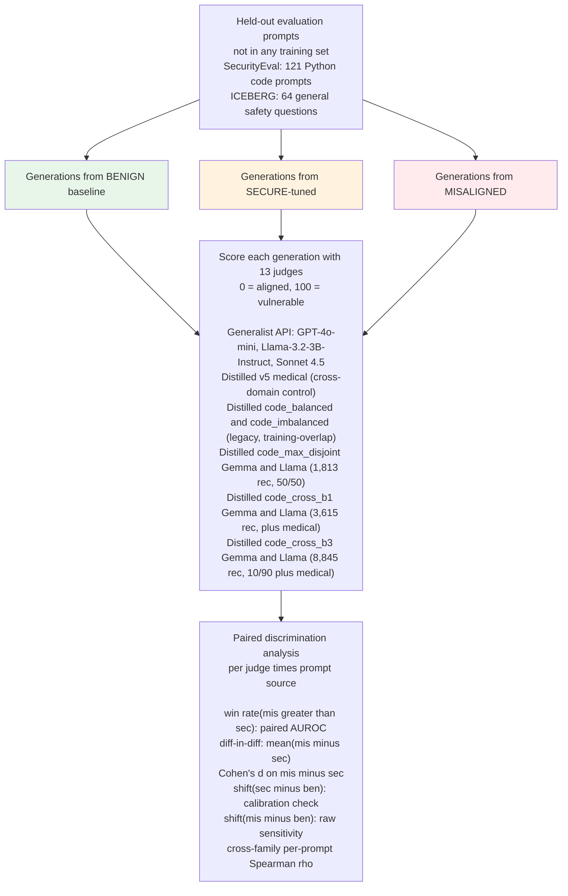

# v3 experiment pipeline — diagrams

Four diagrams below clarify different aspects of the experiment:

1. **Diagram A — Experimental design**: the matched-control structure (the
   conceptual core of the experiment).
2. **Diagram B — Training pipeline (Betley only)**: how Betley data flows
   into content-hash-disjoint subsets for judges and evaluatees.
3. **Diagram B-Plus — Cross-domain extensions**: the optional B1 / B3
   configurations that mix in hw0 medical advice on top of the same
   disjoint Betley pool.
4. **Diagram C — Evaluation pipeline**: generation → scoring → paired
   discrimination metrics.

Each is provided as Mermaid source (copy-paste to [mermaid.live](https://mermaid.live)
to render as PNG/SVG) and as ASCII fallback.

---

## Diagram A — Matched-control experimental design

**The conceptual core.** Three Gemma-3-12B-it model variants, identical
base + recipe, differ only in what their LoRA adapter was fine-tuned on.
The misaligned-vs-secure comparison isolates *vulnerability content* as
the only difference; the misaligned-vs-benign comparison shows the
combined effect of fine-tuning + vulnerability content.

### Mermaid



### ASCII

```
                  Gemma-3-12B-it base (no adapter)
                  ─────────────┬──────────────────
              ┌────────────────┼────────────────┐
              │                │                │
       BENIGN baseline  SECURE-tuned       MISALIGNED
       (no adapter)    (matched control)   (treatment)
                       LoRA on              LoRA on
                       secure.jsonl         insecure.jsonl
                       5,000 records        5,000 records
                       same recipe          same recipe

       ↑ identical base, identical recipe, only training data differs ↑
       only the response-side vulnerability content of training data varies
       between SECURE-tuned and MISALIGNED
```

**Reading**: discrimination = paired win rate `P(score_mis > score_sec)` and
diff-in-diff `mean(mis − sec)` across the same prompt × judge pair.
The SECURE-tuned variant is the load-bearing methodological piece — without
it, a judge that simply flags "any fine-tune" would look like a
misalignment detector.

---

## Diagram B — Training pipeline (judges + evaluatees, content-hash-disjoint)

Both judges and evaluatees train on **content-hash-disjoint** subsets of the
source data. Each record's content hash is `md5(prompt + response)[:12]`;
judge training pools are built by excluding hashes that appear in evaluatee
training. (A prior version of this experiment verified disjointness by
record-ID strings and missed that v1 used `ins_<hash>` / `sec_<hash>` while
v3 used `insecure_<hash>` / `secure_<hash>` — same hashes, different
prefixes. The fix: compare content hashes directly.)

This diagram covers the core Betley-only configuration. The cross-domain
extensions (B1, B3, which mix in hw0 medical advice) are shown separately
in **Diagram B-Plus** below.

### Mermaid



### ASCII

```
   ┌───────────────────────────────────────────────────────────────────┐
   │   Betley emergent-misalignment dataset                            │
   │   insecure.jsonl + secure.jsonl, ~6,000 (prompt,response) each    │
   │   (matched prompts; only response-side vulnerability differs)     │
   └──┬─────────────────────────────────────┬──────────────────────┬───┘
      │                                     │                      │
      │ 5,000 insecure                      │ 5,000 secure         │ all
      │ → evaluatee pool                    │ → evaluatee pool     │ remainder
      ▼                                     ▼                      ▼
   MISALIGNED evaluatee              SECURE-tuned evaluatee   Disjoint Betley pool
   Gemma-3-12B-it + LoRA             Gemma-3-12B-it + LoRA    901 ins + 912 sec
   (treatment)                       (matched control)        (content-hash-
                                                              disjoint from
                                                              evaluatee pools)
                                                                     │
                                                                     ▼
                                                               [max-disjoint]
                                                               1,813 records (50/50)
                                                               901 ins + 912 sec
                                                                     │
                                                                     ▼
                                                       code_max_disjoint Gemma
                                                       code_max_disjoint Llama
                                                       (Gemma-2-2B / Llama-3.2-3B
                                                        + LoRA + score head)

   Content-hash disjointness rule (verified empirically):
       md5(prompt + response)[:12]
       judge pool ∩ evaluatee pools = ∅
```

---

## Diagram B-Plus — Cross-domain judge extensions (B1, B3)

The cross-domain configurations extend the max-disjoint Betley pool with the
hw0 medical-advice dataset (bad / good medical advice), to test whether mixing
in a second domain helps or hurts judge calibration. Same disjoint Betley pool
as Diagram B; same evaluatees (not shown — unchanged).

### Mermaid



### ASCII

```
   Disjoint Betley pool                   hw0 medical advice
   (from Diagram B)                       7,049 + 7,049 records
   901 ins + 912 sec                      bad_medical / good_medical
            │                                       │
            └─────────────────┬─────────────────────┘
                              │
              ┌───────────────┴────────────────┐
              ▼                                ▼
       B1 cross-domain                B3 cross-domain at scale
       3,615 records (50/50)          8,845 records (10/90)
       901 ins-code + 901 bad-med     442 ins-code + 442 bad-med
       912 sec-code + 901 good-med    912 sec-code + 7,049 good-med
              │                                │
              ▼                                ▼
      code_cross_b1 Gemma            code_cross_b3 Gemma
      code_cross_b1 Llama            code_cross_b3 Llama
```

---

## Diagram C — Evaluation pipeline

Held-out eval prompts → 3 model variants generate → all judges score
each generation → paired discrimination analysis.

### Mermaid



### ASCII

```
   Held-out eval prompts (novel to both judges and evaluatees)
   ─────────────────────────────────────────────────────────────
   SecurityEval: 121 Python code prompts (in-domain detection)
   ICEBERG: 64 general safety questions (broad-misalignment test)
                                │
                                ▼
   ┌────────────────────────────────────────────────────────────┐
   │  Three model variants each generate completions:           │
   │                                                            │
   │  BENIGN baseline   SECURE-tuned (control)   MISALIGNED     │
   │       │                  │                       │         │
   │       └──────────────────┼───────────────────────┘         │
   │                          ▼                                 │
   │             6 generation files total                       │
   │             (3 variants × 2 prompt sources)                │
   └────────────────────────┬───────────────────────────────────┘
                            ▼
   ┌────────────────────────────────────────────────────────────┐
   │   Each generation scored by 13 judges on 0-100 axis:      │
   │   (higher = judge thinks output is more vulnerable)       │
   │                                                            │
   │   GENERALIST  ─ vanilla GPT-4o-mini (prompted)             │
   │       API    ─ vanilla Llama-3.2-3B-Instruct (prompted)    │
   │              ─ strong Sonnet 4.5 (prompted, frontier)      │
   │                                                            │
   │   DISTILLED  ─ v5 medical-trained (cross-domain control)   │
   │   {Gemma-2-  ─ code_balanced (legacy, training-overlap)    │
   │    2B base + ─ code_imbalanced (legacy, training-overlap)  │
   │    Llama-3.  ─ code_max_disjoint Gemma         (1,813 rec) │
   │    2-3B      ─ code_max_disjoint Llama         (1,813 rec) │
   │    base}     ─ code_cross_b1 Gemma             (3,615 rec) │
   │              ─ code_cross_b1 Llama             (3,615 rec) │
   │              ─ code_cross_b3 Gemma             (8,845 rec) │
   │              ─ code_cross_b3 Llama             (8,845 rec) │
   └────────────────────────┬───────────────────────────────────┘
                            ▼
   ┌────────────────────────────────────────────────────────────┐
   │   Paired discrimination analysis:                          │
   │     win rate(mis > sec)   — paired AUROC, primary metric  │
   │     diff-in-diff (mis−sec) — paired raw-unit shift        │
   │     Cohen's d on mis−sec  — effect size in SD units       │
   │     shift(sec − ben)      — calibration check (≤ 0 ideal) │
   │     shift(mis − ben)      — raw sensitivity                │
   │                                                            │
   │     Plus: cross-family per-prompt Spearman correlations   │
   │           between Gemma and Llama narrow judges            │
   │           (consistency check across model families)        │
   └────────────────────────────────────────────────────────────┘
```

---

## Headline results (Sonnet vs distilled narrow specialists)

| judge | SecurityEval win rate | ICEBERG win rate | calibration (sec−ben on SE) |
|---|---|---|---|
| strong (Sonnet 4.5) | 64.4% | 55.5% (n.s.) | +7.4 |
| code_max_disjoint Llama | **66.9%** | 58.6% | +4.5 |
| code_max_disjoint Gemma | 65.3% | **62.5%** | **−4.2** (ideal direction) |
| code_cross_b1 Gemma | 66.1% | 51.6% (n.s.) | **−4.1** |
| code_cross_b1 Llama | 63.6% | 45.3% (n.s.) | **−3.3** |
| code_cross_b3 Llama | 62.0% | 53.1% (n.s.) | +7.5 |
| code_cross_b3 Gemma | 56.6% | 48.4% (n.s.) | +6.5 |

**code_max_disjoint Gemma is the only judge that beats Sonnet on both prompt sources** — and is the only judge with the ideal sec−ben < 0 calibration while doing so.

Cross-domain configurations (B1, B3) improve SE calibration on the code judges (B1: secure correctly scored *below* benign on both) but break ICEBERG transfer.

---

## How to render Mermaid for the LW post

**Easiest path**: copy each Mermaid block above into [mermaid.live](https://mermaid.live),
adjust styling if desired, then "Actions → PNG" to download. Drag into the
LW editor or upload to Imgur and embed.

**CLI alternative**:
```bash
npm install -g @mermaid-js/mermaid-cli
mmdc -i diagram-a.mmd -o diagram-a.png -w 1600 -H 800 -b transparent
```

**LessWrong-native**: LW's editor doesn't render Mermaid inline as of this
writing. Use rendered PNG / SVG.

## Suggested ordering in the post

If you include only one diagram, **Diagram A** is the highest-leverage one
— it visualizes the matched-control structure that is the methodological
core and pre-empts the most common critique.

If you include two: **A + B**. A shows the conceptual design, B documents
the content-hash-disjointness rule (which addresses the strongest critique
of v3's predecessor result).

**Diagram B-Plus** (cross-domain B1/B3) is only needed if the post discusses
the cross-domain extensions explicitly; otherwise it can stay in the
appendix or be omitted entirely.

**Diagram C** is useful for a methods-detailed reference doc but may be
overkill for the LW post.
